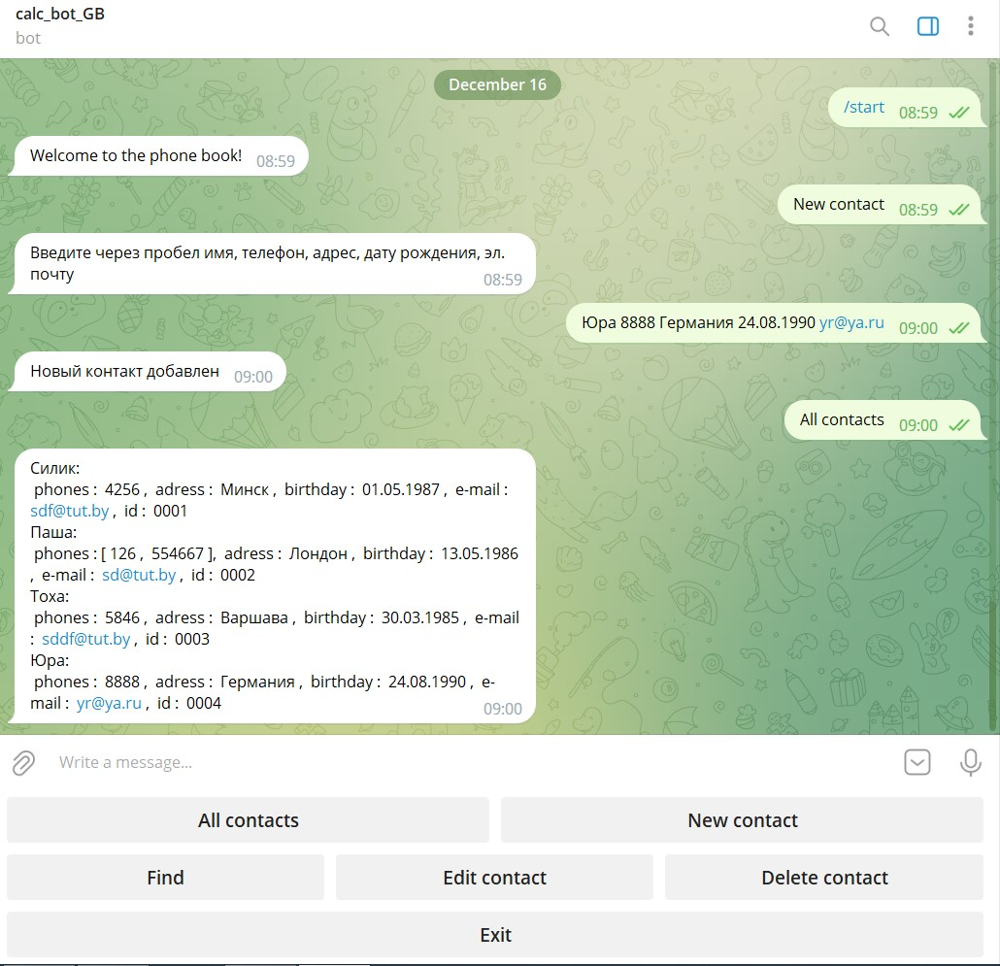
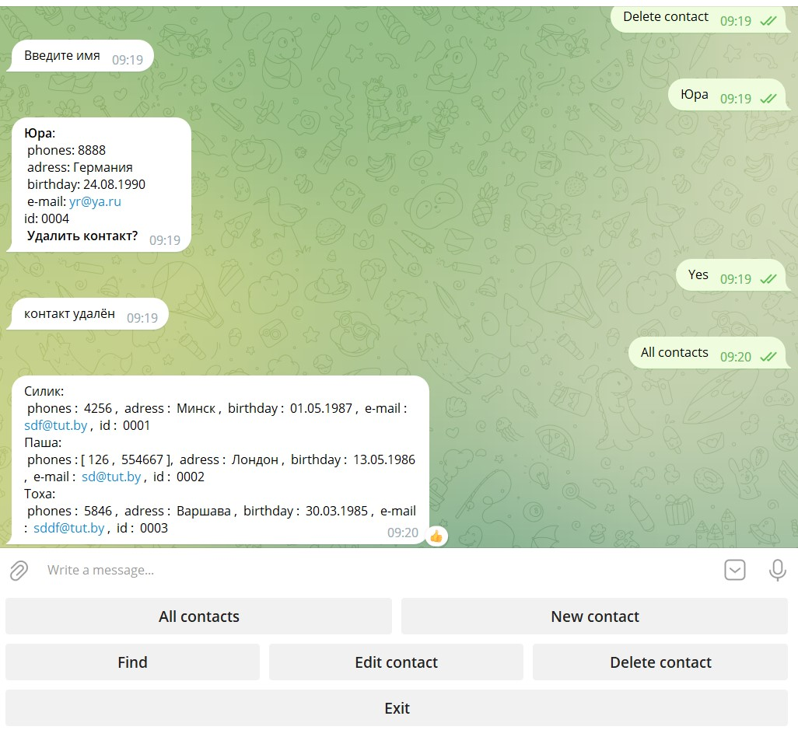
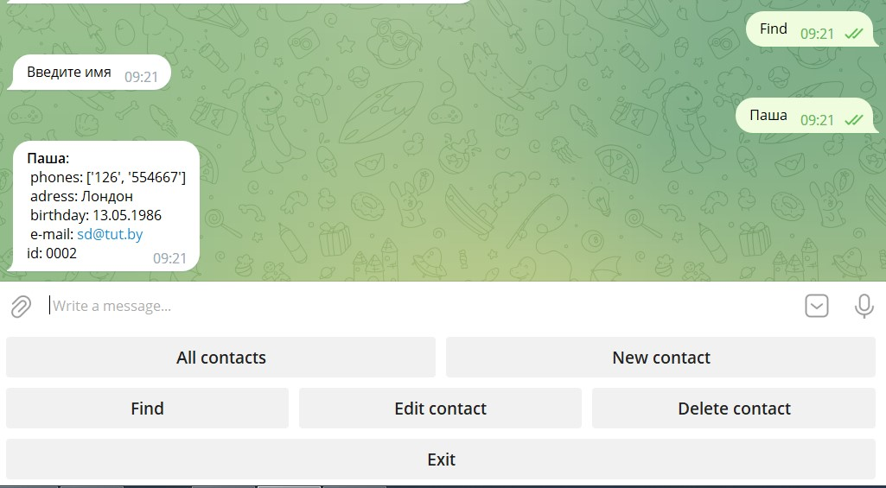
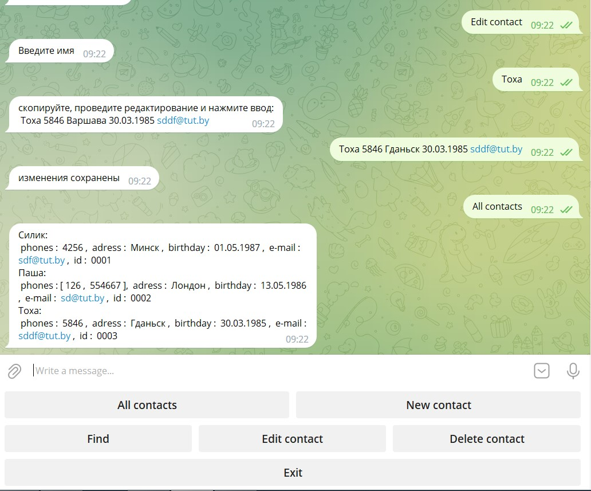

### Что в программе:
В данной программе при помощи телеграмм бота реализован телефонный справочник
### Функционал программы:
Программа позволяет хранить данные о контакте(имя, телефон, адрес, дата рождения, e-mail и id контакта)
Информация хранится в файле  phones.json в виде многоуровневого словаря: 
 
#### Функции:
+ просмотр всех контактов
+ добавление нового контакта
+ удаление контакта
+ редактирование контакта
+ поиск по имени

Результат работы бота представлен на изображениях ниже:

*разработал: Иван Герасименко*

