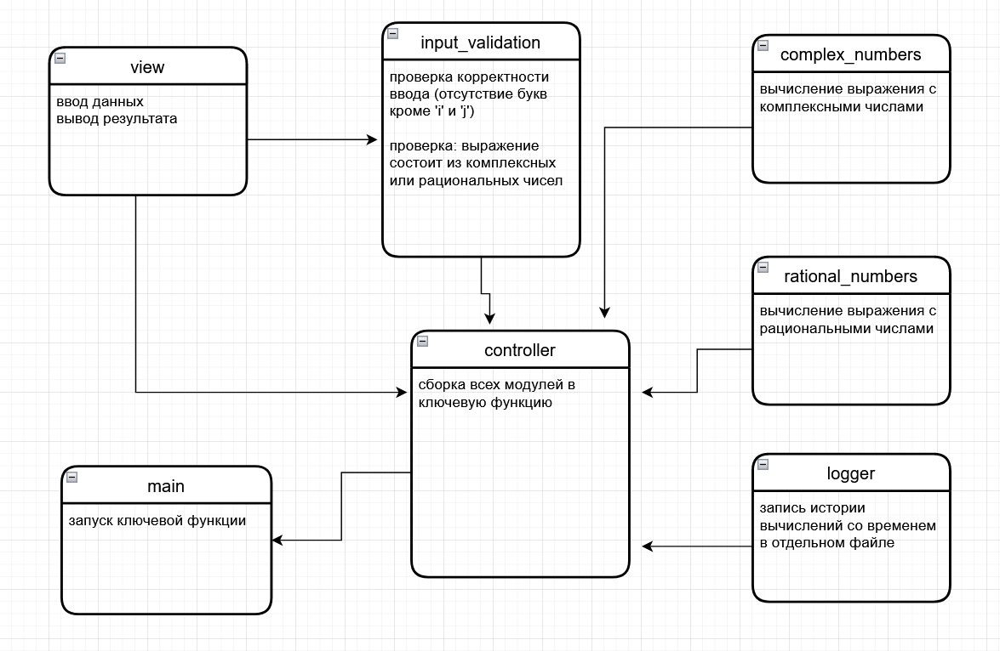

### Что в программе:
В данной программе при помощи модульной архитектуры реализован калькулятор, который считает выражение, введённое пользователем в виде строки.

### Функции калькулятора:
Данный калькулятор работает с рациональными и комплесными числами и поддерживает следующие операции:
+ умножение
+ деление
+ сложение
+ вычитание
+ одноуровневые скобки (вариант со скобками внутри скобок пока не раелизован)

### Модули:
+ #### calc_View
    + запрос данных у пользователя
    + вывод результата
+ #### calc_Input_validation
    + проверка ввода: если в строке присутствут буквенные символы кроме 'i' и 'j' выводится ошибка и с помощью функции из модуля calc_View  запрашивается новый ввод
    + вторая функция определяет вид чисел (клмплексные или рациональные)
+ #### calc_Complex_numbers
    выполняются операции над комплексными числами
+ #### calc_Rational_numbers
    выполняются операции над рациональными числами
+ #### calc_Logger
    функция записи в файл истории вычислений с отображением даты и времени
+ #### calc_Controller
    собирает функции всех модулей в одну ключевую функцию:
    + запрашивает строку с проверкой
    + фиксирует строку в одельну переменную
    + проверяет в выражении комплексные или рациональные числа и вычисляет это выражение
    + результат записывается в отдельную переменную
    + отправляются данные в log.txt и выводится результат на экран
+ #### calc_Main
    запускается ключевая функция

*разработал: Иван Герасименко*
