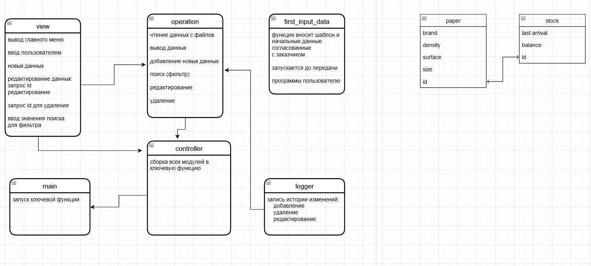

### Что в программе:
В данной программе при помощи модульной архитектуры реализована  информационная система для работы со складом бумаги на полиграфическом производстве
### Функционал программы:
Программа позволяет хранить данные о бумаге  , а также данные о наличии конкретной бумаги на складе и даты последней поставки этой бумаги.
Информация хранится в файле  paper_stock.json в виде двух мнимых таблиц которые связаны между собой id: 
+ 'paper': производитель, плотность, поверхность,формат, id
+ 'stock': дата последнего прихода, остаток на складе, id
 
Реализованы проверки корректности ввода пользователем команд и информации.
#### Функции:
+ просмотр всех позиций
+ добавление новой позиции
+ удаление позиции
+ редактирование даты последнего прихода и остатка бумаги на складе
+ фильтр/поиск по значениям из таблицы
+ просмотр журнала изменений

### Модули:
Функционал модулей и структура данных представлены на прикреплённом к проекту изображении 1.jpg

*разработал: Иван Герасименко*

